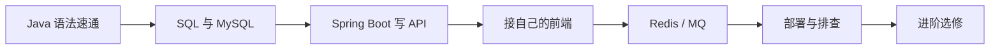
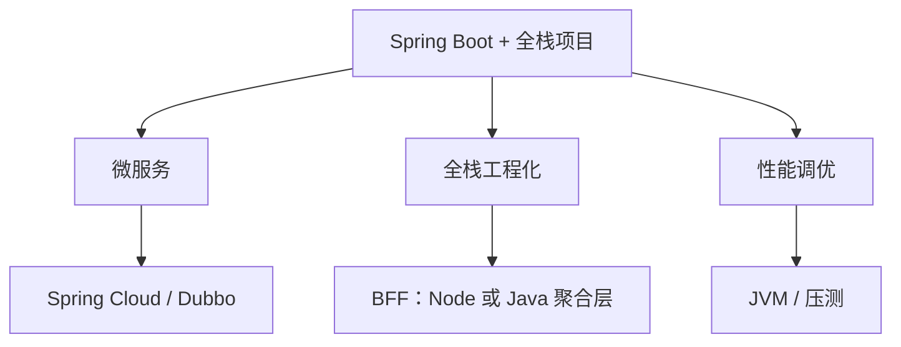

> 你已经会调接口、写组件、处理异步和构建部署——这些在转 Java 后端时**不是从零开始**。真正的门槛在于：静态类型 + 编译型语言思维、面向对象与分层架构、SQL/事务，以及 Spring 生态的「约定优于配置」。本文按**前端开发者已有基础**重排学习顺序，帮你少走弯路。

## 一、前端转后端，值不值得？

**值得，而且你有天然优势。**

日常协作里，你早就接触过：

- RESTful 接口、状态码、JSON、跨域、Cookie / Token；
- 异步流程（`Promise`、`async/await`）与错误处理；
- 工程化（npm/pnpm、Vite/Webpack、ESLint、环境变量）；
- 与后端联调、看 Swagger/Apifox、Mock 数据。

转后端不是抛弃这些，而是**站到接口提供方**，把业务规则、数据一致性和权限边界写进服务端。国内岗位里「Java + Spring Boot + MySQL」仍是主力组合；全栈或「大前端 + 懂后端」在团队里也很吃香。

**2026 年招聘常见要求：**

- 能独立交付 REST API 与业务模块；
- Spring Boot + MySQL，了解 Redis / 消息队列；
- 单元测试、日志、基本线上排查；
- 加分项：微服务、Docker、性能调优。

## 二、你会什么、要补什么

### 2.1 可直接复用（不必当「零基础」重学）

| 你已有的（前端） | 后端对应 | 说明 |
|------------------|----------|------|
| `fetch` / Axios 调 API | 写 `@RestController` 提供 API | 你更清楚前端要什么字段、什么错误体 |
| HTTP、CORS、JWT 使用 | Spring Security、拦截器、鉴权 | 从「消费者」变「提供者」，概念对齐很快 |
| JSON 序列化 | Jackson / Fastjson2 | 字段命名、`null`、日期格式仍是联调痛点，你已有经验 |
| `async/await` | 线程、虚拟线程、阻塞 I/O | 语义不同，但「等 I/O 时别占着 UI」的直觉可迁移 |
| TypeScript 类型 | Java 泛型、强类型 | TS 写得熟，Java 类型系统上手更快 |
| npm / pnpm | Maven / Gradle | 都是依赖管理 + 脚本；`pom.xml` ≈ `package.json` + 构建逻辑 |
| `.env` / `import.meta.env` | `application.yml` + Profile | 多环境配置思路一致 |
| Git、PR、Code Review | 完全相同 | 直接沿用 |
| Docker 部署前端 | Docker 部署 Spring Boot | 命令与镜像思路相通 |
| Vue/React 状态管理 | 理解服务端「无状态」与 Session/Redis | 你会更容易理解为何 API 要幂等、为何要 Token |

### 2.2 必须正经补的（前端经验覆盖不到）

| 短板 | 为什么前端容易忽略 | 建议优先级 |
|------|-------------------|------------|
| **SQL 与事务** | 前端很少写 `JOIN`、索引、隔离级别 | ⭐⭐⭐ 高 |
| **面向对象与设计分层** | JS 以函数 + 组件为主，Java 以类 + 接口为主 | ⭐⭐⭐ 高 |
| **编译、JVM、包结构** | 没有「改完即跑」的解释执行 | ⭐⭐ 中 |
| **Spring 依赖注入（IoC）** | 和 React Context 有点像，但生命周期、代理、AOP 更复杂 | ⭐⭐⭐ 高 |
| **并发与线程安全** | 浏览器单线程模型不同 | ⭐⭐ 中（先懂概念，深入可后置） |
| **服务端排查** | 堆栈、日志、连接池、慢 SQL | ⭐⭐ 中 |

### 2.3 前端思维 → Java 思维：几张对照表

**语法层：**

```javascript
// JavaScript
const user = { id: 1, name: "Ana" };
const list = [1, 2, 3];
list.map(x => x * 2);
```

```java
// Java：类型声明、接口、集合泛型
record User(long id, String name) {}
List<Integer> list = List.of(1, 2, 3);
list.stream().map(x -> x * 2).toList();
```

**工程层：**

| 前端 | Java 后端 |
|------|-----------|
| `package.json` + `node_modules` | `pom.xml` / `build.gradle` + 本地 Maven 仓库 |
| `npm run dev` | `mvn spring-boot:run` 或 IDEA 运行 |
| Vite 代理 `/api` → 后端 | 开发期同样可代理；生产由 Nginx / 网关转发 |
| 组件 `props` 单向数据流 | Controller 入参 DTO → Service → 返回 VO，**不要**把 Entity 直接给前端 |

**你要改的一个习惯：** 前端常把「状态放浏览器」；后端默认**无状态**，会话与权限靠 Token/Redis/DB，业务真相以数据库为准。

## 三、JDK 版本怎么选？

| 版本 | 定位（2026） | 建议 |
|------|----------------|------|
| Java 8 | 存量系统 | 维护老项目才深入；**新项目别从 8 学起** |
| **Java 17** | Spring Boot 3 最低要求 | **语法基线**：`record`、密封类、模式匹配 |
| **Java 21** | 生产主流 LTS | **推荐学习版本**：虚拟线程 |
| **Java 25** | 2025 LTS | 个人新项目可跟进；求职以 17/21 为主 |

```java
// 前端同学会喜欢的：record ≈ 不可变 TS interface + 构造
public record UserDto(Long id, String name, String email) {}
```

```properties
# Spring Boot 3.2+：虚拟线程，适合 I/O 密集 API
spring.threads.virtual.enabled=true
```

环境：**JDK 21 + IntelliJ IDEA Community**（类似 VS Code 地位，调试 Java 更顺手）。

## 四、路线总览（前端定制版）



| 阶段 | 主题 | 建议时长 | 产出物 |
|------|------|----------|--------|
| ~~0 编程基础~~ | **跳过** | 0 | 你已有 |
| 1 | Java 语法 + OOP 速通 | 2～3 周 | 控制台小练习 + 看懂集合与异常 |
| 2 | SQL + MyBatis-Plus | 2～3 周 | 建表 + CRUD SQL |
| 3 | Spring Boot 提供 REST API | 4～6 周 | **给现有 Vue/React 项目供数** |
| 4 | 鉴权、校验、异常、文档 | 1～2 周 | 与前端联调一致的接口规范 |
| 5 | Redis / 消息队列入门 | 2～3 周 | 缓存 + 异步通知 |
| 6 | 测试、Docker、日志 | 2 周 | 本地 `docker compose` 一键起 |
| 7 | 进阶 | 持续 | 微服务 / JVM / DDD |

**和通用路线的最大区别：** 不要先在控制台刷很久题——**尽快写出能被 `fetch` 调到的 HTTP 接口**，用你熟悉的前端页面验证，成就感与理解速度都更好。

## 五、阶段 1：Java 语法速通（2～3 周）

前端转过来**不必**按计算机专业大一节奏学；重点补「和 JS 不一样」的部分。

### 1.1 优先掌握

- 基本类型 vs 引用类型；`String` 不可变。
- 类、接口、抽象类；`implements` / `extends`。
- 集合：`ArrayList`、`HashMap`；遍历与 `Stream`（类似 `map/filter/reduce`）。
- 异常：`try-catch`、受检异常（Checked Exception）——这是 JS 没有的，先接受「方法签名要声明 throws」。
- 泛型：`List<String>`、`Map<K,V>`；能读懂即可，不必先钻类型擦除。
- Maven：`pom.xml` 加依赖 ≈ `npm install`；`mvn test` ≈ `npm test`。

### 1.2 可后置（用到再学）

- 多线程底层、`synchronized` 细节（先知道「Service 默认单例要小心成员变量」）。
- IO/NIO 字节流（Spring 帮你挡掉大部分）。
- 反射、字节码（框架学习时会碰到）。

### 1.3 练手建议

- 用 Java 重写你熟悉的一个小逻辑（待办列表、分页列表数据处理），**不要**花两周只做命令行菜单。
- LeetCode 简单题 20 道足够建立「Java 写法」手感，算法你多半已有基础。

**过关标准：** 能在 IDEA 里打断点调试，看懂 `HashMap` / `ArrayList` 选型，写 3 个 JUnit 5 测试。

## 六、阶段 2：SQL 与数据库（2～3 周）

这是**前端转后端的第一道硬坎**——再熟的 React 也替不了 `JOIN` 和事务。

### 2.1 SQL 必会

- `CREATE TABLE`、主键、外键、索引。
- `SELECT ... JOIN ... WHERE ... GROUP BY`。
- `EXPLAIN` 看是否走索引。
- 事务：转账例子理解 ACID；`@Transactional` 为何加在 Service 上。

### 2.2 练手：用「你前端项目」的业务建表

例如你做过博客/商城/后台管理——自己设计 `user`、`article`、`order` 表，比抄教程更有代入感。

### 2.3 Java 持久化

- **MyBatis-Plus**（国内极常见）：`BaseMapper`、条件构造器、分页；XML 写复杂 SQL。
- JPA 可选：和 TypeORM 有点像，但国内面试 MyBatis 问得更多。

**过关标准：** 能画出「前端点提交订单 → 后端写哪些表、事务在哪一层」的时序图。

## 七、阶段 3：Spring Boot——终于和你前端连上了（4～6 周）

### 3.1 学习顺序（按联调顺序）

1. **第一个 `@RestController`**：`GET /api/health` 返回 JSON——用浏览器或现有 Axios 直接调通。
2. **统一响应体**：`{ code, data, message }`，和你前端 `request` 封装对齐（很多团队本来就这么约定）。
3. **CRUD**：列表分页、详情、创建、更新、删除；对照你熟悉的 REST 语义。
4. **参数校验**：`@Valid` + `@NotBlank` 等，错误体格式**提前和前端约定**。
5. **全局异常**：`@ControllerAdvice`，别让每个接口各自 `try-catch`。
6. **MyBatis-Plus 接入**：Entity 不要直接返回给前端，用 DTO/VO（类似不要把 DB 原始结构塞进 React props）。
7. **登录鉴权**：JWT 或 Session；你用过 Token，实现一遍会通透很多。

### 3.2 最推荐的项目方式：**全栈重做一遍你熟的业务**

| 做法 | 说明 |
|------|------|
| 前端 | 继续用 Vue3 / React + 你熟悉的 UI 库 |
| 后端 | 新建 Spring Boot 项目，只提供 API |
| 联调 | 开发期 Vite `proxy` 到 `localhost:8080` |
| 文档 | Knife4j / Apifox——**你会导入，也要会导出给别人用** |

可选业务：博客 CMS、个人记账、简易电商、工单系统——选你前端做过的，**只替换 Mock 为真 API**。

### 3.3 自检清单（按前端视角）

- [ ] 跨域：开发代理 + 生产 Nginx 方案能说清楚
- [ ] 列表接口：分页参数名与前端一致（`page`/`pageSize` 或 `current`/`size`）
- [ ] 错误码：401/403/422 与前端路由、提示对应
- [ ] 日期格式：统一 ISO 或时间戳，避免 `JSON` 时区坑
- [ ] 文件上传：`multipart/form-data` 与前端 `FormData` 联调通过
- [ ] 接口文档与 Apifox Mock 可被前端一键导入

### 3.4 版本建议（2026）

| 场景 | 组合 |
|------|------|
| 学习 / 个人全栈项目 | Java 21 + Spring Boot 3.4.x / 3.5.x |
| 公司技术栈（见本站项目约定） | Java 17 + Spring Boot 3.5 + MyBatis-Plus |
| 尝鲜 | Java 25 + Spring Boot 4.0（需单独读迁移说明） |

## 八、阶段 4～6：中间件、工程化、部署

### 8.1 Redis（你大概率听过，现在要会写）

- 缓存热点数据；登录 Token 存 Redis。
- 结合前端：列表页缓存、接口防抖、验证码 TTL——都是你会遇到的场景。

### 8.2 消息队列（择一）

- RabbitMQ / RocketMQ：下单后异步发短信、削峰。
- 理解：前端「发请求等响应」vs 后端「发消息慢慢消费」。

### 8.3 测试与部署

- JUnit 5 + Mockito：测 Service 业务，类似给纯函数写单测。
- `Dockerfile` + `docker compose`（MySQL + Redis + 后端）；前端静态资源仍可走 Vercel/Nginx。

### 8.4 线上排查（前端较少练）

- 看 Logback 日志、HTTP 5xx 堆栈。
- 慢接口：先查 SQL `EXPLAIN`，再查连接池。
- 可选：Arthas、Actuator `/actuator/health`。

## 九、进阶方向（按需）



- **全栈工程师**：保持前端深度 + 独立后端模块，团队沟通成本最低。
- **BFF**：若公司用 Node 做中间层，你两边都能接；纯 Java 团队则用 Gateway 聚合。
- **微服务**：会拆分单体边界后再学，别第一天就 Nacos + 十个服务。

## 十、AI 时代：前端转后端怎么用 AI

你大概已经在用 Cursor 写 React——转 Java 时同样适用，注意几点：

| 场景 | 做法 |
|------|------|
| 从 TS 接口生成 Java DTO | 让 AI 生成后**对照字段类型与可空** |
| 写 Controller 样板 | 生成后检查：事务边界、权限注解、是否泄漏 Entity |
| 看不懂 Maven 依赖冲突 | 贴完整报错，问「缺哪颗树、哪条路径冲突」 |
| 和前端联调不通 | 让 AI 对比「前端 Axios 配置」与「后端 CORS/Security」 |

原则不变：先自己搭骨架跑通 `GET /api/health`，再让 AI 填 CRUD；每个生成的方法问一句「并发下安全吗？事务加在哪？」

可参考本站：[AI 通用规则与技能](/zh/blog/ai-rules-and-skills)、[Cursor 接入 Apifox MCP](/zh/blog/cursor-apifox-mcp)。

## 十一、推荐资源

### 书籍（按前端背景排序）

| 书名 | 说明 |
|------|------|
| 《Head First Java》 | 快速建立 OOP 直觉，不必逐字啃 |
| 《Spring 实战》 | 配合做 API 时翻 |
| 《MySQL 必知必会》 | 补 SQL 短板 |
| 《Effective Java》 | 有项目经验后再读，收益更大 |

### 文档

- [Spring Boot 官方文档](https://docs.spring.io/spring-boot/docs/current/reference/html/)
- [MyBatis-Plus](https://baomidou.com/)
- 本站：[前端高频面试题](/zh/blog/frontend-interview-questions) 里的**网络、浏览器、安全**篇，和后端鉴权、HTTPS 是同一套知识

### 视频筛选

B 站搜课选 **Spring Boot 3**，跳过 SSH、JSP、纯 Servlet 老路线；你已会前端，**不必看课里顺带教 HTML 的章节**。

## 十二、前端转后端常见误区

1. **死磕 Java 语法两个月仍不写 HTTP 接口**——应第一周就 `spring-boot:run` + 前端 `fetch` 调通。
2. **用前端思维把数据库当 JSON 存**——该范式设计就范式，该索引就索引。
3. **Entity 直接返回给前端**——字段全暴露、循环引用、懒加载报错，都是坑。
4. **忽视事务**——「前端一次提交」在后端可能对应多表写入，必须 `@Transactional`。
5. **觉得会 Docker 部署前端就够**——还要会起 MySQL、配 JDBC URL、看后端日志。
6. **过早微服务**——一个「前端 + 单体 Spring Boot」完整项目，比空有概念强十倍。

## 十三、10 周计划（在职前端，每天 1.5～2h）

| 周次 | 重点 | 联动前端 |
|------|------|----------|
| 1 | Java 语法 + Maven + IDEA 调试 | 无 |
| 2 | SQL 建表 + MyBatis-Plus 查询 | 设计和你页面一致的字段 |
| 3～4 | Spring Boot CRUD API | Vite 代理联调列表/详情 |
| 5 | 登录 JWT + 统一异常/校验 | 接 Axios 拦截器 |
| 6 | 文件上传、分页、搜索 | 接你现有表单与表格组件 |
| 7 | Redis 缓存 | 感受列表接口变快 |
| 8 | 消息队列（一个场景） | 下单后前端轮询/ WebSocket 可选 |
| 9 | Docker compose 部署 | 前后端一起写 README |
| 10 | 面试题：Java 集合 + Spring 生命周期 + 项目讲解 | 用全栈项目讲 STAR |

每周留半天复盘：把「本周 API 变更」同步到 Apifox，**养成和后端同事一样的文档习惯**。

## 结语

对你来说，最优路径不是「重新当编程零基础」，而是：

**Java 语法速通 → SQL → Spring Boot 出接口 → 用你已会的前端验证 → Redis/部署补全。**

2026 年简历上的「最小可信集合」：**一个你能现场演示前后端联调的项目**（GitHub + 在线演示或录屏），比罗列十个框架名词更有说服力。

从本周开始：装好 JDK 21 和 IDEA，用 Spring Initializr 生成项目，把你前端项目里的**第一个列表接口**从 Mock 换成真数据——这一步，比收藏任何路线文都管用。
