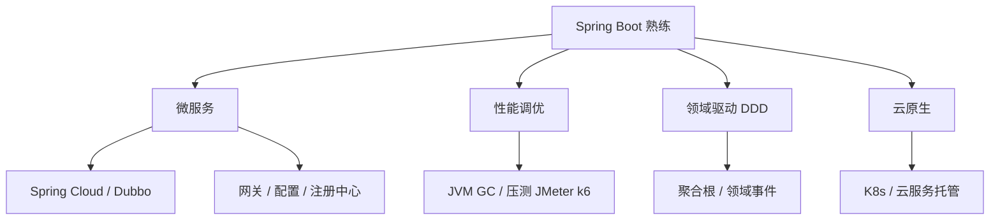

> 2026 年的 Java 早已不是「写 Servlet + SSH 框架」的时代。虚拟线程、记录类型、模式匹配让语言更现代；Spring Boot 3.x/4.x 全面拥抱 Jakarta EE；云原生与 AI 辅助编程也改变了学习节奏。本文给出一条**可落地、可衡量进度**的后端路线，适合在校生、转行者，以及从 Java 8/11 升级技能栈的在职工程师。

## 一、2026 年还要学 Java 吗？

**要，而且岗位面依然很宽**——银行、政务、电商、物流、物联网、大数据底座里，Java 仍是主力语言之一。招聘侧常见要求是：

- 能独立交付 REST API 与业务模块；
- 熟悉 Spring Boot + MySQL，了解 Redis / 消息队列；
- 具备单元测试、日志、排查线上问题的基本素养；
- 加分项：微服务、容器化、性能调优、领域建模。

与十年前不同的是：**只会 CRUD 不够**，但「Java + Spring + 工程化」仍是国内后端面试与日常开发的高频组合。把基础打牢，再按方向纵深（中间件 / 架构 / 云原生），性价比很高。

## 二、JDK 版本怎么选？

| 版本 | 定位（2026） | 建议 |
|------|----------------|------|
| Java 8 | 大量存量系统 | 维护老项目必懂；**新项目不要从这里起步** |
| Java 11 | 过渡 LTS | 读懂即可，面试可能问到 |
| **Java 17** | 活跃 LTS，Spring Boot 3 最低要求 | **学习基线**：记录类型、密封类、`switch` 模式匹配、文本块 |
| **Java 21** | 2023 LTS，生产主流 | **优先掌握**：虚拟线程（Virtual Threads）、有序集合、记录模式 |
| **Java 25** | 2025 LTS，支持至约 2033 | **新项目目标**；性能与语言特性进一步演进 |

**实操建议：**

- 学习与环境：**JDK 21 或 25**（IDEA 2024+、Maven 3.9+ 均支持良好）。
- 公司仍要求 17：语法以 17 为下限，虚拟线程等 21 特性可在个人项目里练。
- 别在版本上纠结太久——**语言核心 + Spring 生态**占时间的大头。

```java
// Java 17+：记录类型简化不可变 DTO
public record UserDto(Long id, String name, String email) {}

// Java 21+：虚拟线程适合 I/O 密集（HTTP、DB、RPC）
try (var executor = Executors.newVirtualThreadPerTaskExecutor()) {
    executor.submit(() -> callRemoteApi());
}
```

Spring Boot 3.2+ 开启虚拟线程只需：

```properties
spring.threads.virtual.enabled=true
```

## 三、路线总览


| 阶段 | 主题 | 建议时长 | 产出物 |
|------|------|----------|--------|
| 0 | 编程与计算机基础 | 2～4 周 | 能写小程序、懂基本数据结构 |
| 1 | 核心 Java 语法与 OOP | 4～6 周 | 控制台小项目 + LeetCode 简单题 |
| 2 | 现代 Java 特性 | 2～3 周 | 用 record / 虚拟线程改写示例 |
| 3 | 数据库与 SQL | 2～3 周 | 建表、索引、事务实验报告 |
| 4 | Spring Boot Web | 6～8 周 | **完整 CRUD 后台 + 登录** |
| 5 | 中间件入门 | 4～6 周 | 缓存、消息队列、分布式锁 Demo |
| 6 | 测试、CI、容器 | 3～4 周 | 单测覆盖 + Docker 跑通 |
| 7 | 进阶（选修） | 持续 | 微服务 / 性能 / 领域驱动等 |

以下为各阶段**学什么、怎么练、学到什么程度算过关**。

## 四、阶段 0：编程与计算机基础

若你已有 Python / JavaScript / C 基础，可压缩到 1 周查漏补缺。

- **内容**：变量、分支循环、函数、数组、基础算法（排序、二分、简单递归）、时间复杂度直觉。
- **工具**：任意编辑器 → 尽快切到 **IntelliJ IDEA Community**（社区版免费够用）。
- **练习**：[LeetCode](https://leetcode.cn) 简单题 30～50 道，或 [洛谷](https://www.luogu.com.cn) 入门题。
- **过关标准**：不看答案能写「学生成绩统计」「通讯录增删改查（控制台版）」。

## 五、阶段 1：核心 Java

### 1.1 必会语法与概念

- 面向对象：封装、继承、多态；接口与抽象类；`static` / `final`。
- 集合框架：`List`、`Set`、`Map` 及常见实现类选型；`Iterator`；`Comparable` / `Comparator`。
- 异常：`try-catch-finally`、`try-with-resources`；受检与非受检异常。
- 泛型：类型擦除、通配符 `? extends` / `? super`（能读懂框架代码即可）。
- IO 与 NIO 基础：`InputStream` / `OutputStream`、字符流、`Files`、`Path`。
- 并发入门：`synchronized`、`volatile`、`Thread`、`ExecutorService`；知道「线程池参数」含义即可，深入放到阶段 5。
- 新日期 API：`LocalDate`、`LocalDateTime`、`ZonedDateTime`、`Duration`。

### 1.2 必会工具

| 工具 | 用途 |
|------|------|
| JDK | 编译运行 |
| Maven 或 Gradle | 依赖与构建（国内项目 Maven 更常见） |
| Git | 分支、提交、合并、解决冲突 |
| IDEA | 调试、重构、断点、Maven 面板 |

### 1.3 练习项目建议

- **命令行图书管理系统**（增删改查 + 文件持久化 JSON）。
- **多线程下载器（简化版）**：体会线程与阻塞 I/O。

**过关标准**：能向他人讲清楚「`HashMap` 大致原理」「`ArrayList` 与 `LinkedList` 区别」，并用 JUnit 5 给核心方法写 3～5 个测试。

## 六、阶段 2：现代 Java（17 / 21+）

在阶段 1 之上叠加，**不要跳过**——面试与开源代码里已大量出现。

| 特性 | 说明 | 练手方式 |
|------|------|----------|
| `record` | 不可变数据载体 | 替换旧式 DTO / 贫血 getter-setter |
| `sealed class` | 受限继承层次 | 建模订单状态机 |
| 模式匹配 `instanceof` / `switch` | 减少强转样板代码 | 重构旧 `if-else` 分支 |
| 文本块 `"""` | 多行字符串 | SQL、JSON 模板 |
| 虚拟线程（21+） | 高并发 I/O | 压测对比平台线程 vs 虚拟线程 |
| `Optional` | 避免 NPE | 仓储层返回值规范 |

推荐阅读：Oracle 官方 [Java SE 新特性文档](https://docs.oracle.com/en/java/javase/) 各版本 Release Notes。

## 七、阶段 3：数据库与 SQL

后端离不开数据持久化。

### 3.1 SQL 核心

- DDL / DML：`CREATE`、`INSERT`、`UPDATE`、`DELETE`。
- 查询：`JOIN`（内连接、左连接）、子查询、聚合、`GROUP BY`、`HAVING`。
- 约束：主键、唯一、外键、非空、默认值。
- 索引：B+ 树直觉、最左前缀、覆盖索引；**会看 `EXPLAIN`**。
- 事务：ACID、`READ COMMITTED` / `REPEATABLE READ`；脏读、不可重复读、幻读。

### 3.2 MySQL 实操

- 安装本地 MySQL 8 或使用 Docker。
- 设计 3～5 张表的**电商简化模型**（用户、商品、订单、订单项）。
- 练习：分页查询、慢 SQL 优化、合理使用索引。

### 3.3 Java 侧持久化

- **JDBC**：理解连接、预编译、`ResultSet`（知道原理即可）。
- **MyBatis 或 MyBatis-Plus**：国内岗位极高频；会写 Mapper、XML/注解 SQL、分页插件。
- **Spring Data JPA**（选修）：快速原型、复杂动态查询可对比 MyBatis。

**过关标准**：独立完成「用户注册登录 + 商品列表 + 下单」表结构设计，并能解释一次下单流程中事务边界怎么划。

## 八、阶段 4：Spring Boot 生态（核心）

这是**求职主战场**，时间投入建议最多。

### 4.1 学习顺序

1. **Spring 核心**：IoC、DI、AOP 概念；`@Component`、`@Autowired`、`@Configuration`。
2. **Spring Boot**：自动配置、`application.yml`、Profile、Actuator 健康检查。
3. **Spring Web**：`@RestController`、参数校验（`@Valid` + Hibernate Validator）、统一异常处理、`@ControllerAdvice`。
4. **Spring Security**（或 Sa-Token 等）：登录、JWT、权限注解；先实现「能用的认证」再追求优雅。
5. **整合 MyBatis-Plus**：实体、Service、分页、逻辑删除、乐观锁字段。

### 4.2 必做综合项目（至少一个）

任选业务域，做到**可演示、可部署、有 README**：

- 博客 / CMS（文章、标签、评论、Markdown）。
- 在线考试 / 问卷系统。
- 简易电商后台（商品 SKU、购物车、订单状态机）。
- 工单 / 审批流（练状态与权限）。

**项目清单（自检）：**

- [ ] RESTful API 设计合理，状态码与错误体统一
- [ ] 参数校验 + 全局异常处理
- [ ] 登录鉴权（Session 或 JWT 二选一）
- [ ] 操作日志或审计字段（`created_at`、`updated_by`）
- [ ] 分页、条件查询
- [ ] 单元测试覆盖核心 Service
- [ ] Swagger / Knife4j 或 Apifox 导出接口文档

### 4.3 版本对应（2026）

| 场景 | 推荐组合 |
|------|----------|
| 学习 / 个人项目 | Java 21 + Spring Boot 3.4.x / 3.5.x |
| 企业存量升级 | Java 17 + Spring Boot 3.2+ |
| 跟进最新 | Java 25 + Spring Boot 4.0（Jakarta EE 11、Spring Framework 7，需单独读迁移指南） |

从 Spring Boot 2.x 升级需关注：`javax.*` → `jakarta.*` 包名迁移、Spring Security 6 配置方式变化。

## 九、阶段 5：中间件与分布式入门

单体项目跑通后，再学「为什么需要中间件」。

| 中间件 | 学什么 | 练手 |
|--------|--------|------|
| **Redis** | 五种基础类型、过期、缓存穿透/击穿/雪崩、分布式锁 | 热点数据缓存 + 库存扣减 |
| **消息队列**（RabbitMQ / RocketMQ / Kafka 择一） | 生产者消费者、确认机制、幂等、死信 | 下单后发消息、异步通知 |
| **Elasticsearch**（选修） | 倒排索引、分词、简单聚合 | 商品搜索 |
| **Nacos / Consul**（选修） | 服务注册发现、配置中心 | 双实例网关路由 |

**分布式基础概念**（面试高频，先建立地图）：

- CAP、BASE；最终一致性。
- 分布式 ID（雪花、号段）。
- 接口幂等、限流、熔断降级（了解 Sentinel / Resilience4j）。

**过关标准**：能画一张「用户下单」时序图，标出 DB、Redis、MQ 的读写点，并说明失败如何补偿。

## 十、阶段 6：工程化、测试与部署

### 10.1 测试

- **JUnit 5**：`@Test`、`@ParameterizedTest`、`@MockBean`。
- **Mockito**：模拟依赖，测 Service 业务规则。
- 测试金字塔：单测为主，集成测试覆盖关键链路；E2E 适量。

### 10.2 代码质量

- 阿里巴巴 Java 开发手册（或 Google Java Style）浏览一遍。
- Checkstyle / SpotBugs 在 Maven 里跑通即可。
- 日志：SLF4J + Logback；**禁止** `System.out.println` 打生产日志。

### 10.3 构建与部署

- Maven 多模块项目结构（`api` / `service` / `common`）。
- **Docker**：编写 `Dockerfile`，`docker compose` 起 MySQL + Redis + 应用。
- CI 概念：GitHub Actions 或 Jenkins 跑 `mvn test`。
- 了解 Kubernetes 是什么即可（深入可放进阶）。

### 10.4 可观测性（了解）

- 日志集中、链路追踪（Micrometer + OpenTelemetry / SkyWalking）、指标与告警。
- 会看 JVM 堆栈、线程 dump、Arthas 常用命令加分。

## 十一、阶段 7：进阶方向（按兴趣选修）



- **微服务**：Spring Cloud Alibaba（Nacos、Sentinel、Gateway）或 Dubbo；理解「何时不该微服务」。
- **性能**：JVM 内存模型、GC 日志、async-profiler；压测与瓶颈定位。
- **DDD**：适合复杂业务域；先读《实现领域驱动设计》前几章，小范围实践聚合划分。
- **大数据 / 流式**（选修）：Flink、Spark Java API。
- **安全**：OWASP Top 10、SQL 注入、越权、敏感数据脱敏。

## 十二、AI 时代怎么学 Java 更高效

与本站其他文章一脉相承：**AI 是加速器，不是替代品**。

| 场景 | 推荐做法 |
|------|----------|
| 看不懂报错 | 把堆栈贴给 Cursor / Copilot，要求**解释根因**而非直接改生产代码 |
| 写样板代码 | 用 AI 生成 Controller / DTO / Mapper，**人工审查**事务与安全 |
| 补单测 | [Diffblue Cover](https://www.diffblue.com) 或 AI 生成 JUnit 草稿，再补边界用例 |
| 读开源项目 | 让 AI 按调用链画序列图，自己对照源码验证 |
| 面试准备 | 让 AI 出题 + 追问，但**必须手写**核心题（HashMap、线程池、Spring 循环依赖） |

**原则：**

1. 先自己写 30 分钟，再问 AI——避免「看会了写不出」。
2. 每个 AI 生成的片段问一句：**为什么这样写？有没有并发 / 安全问题？**
3. 把 Prompt 里的「项目约定」固化成规则（可参考本站《AI 通用规则与技能》）。

## 十三、推荐资源

### 书籍

| 书名 | 适合阶段 |
|------|----------|
| 《Head First Java》 | 零基础入门 |
| 《Effective Java》（第 3 版） | 进阶必读 |
| 《Java 并发编程实战》 | 并发深化 |
| 《Spring 实战》 | Spring Boot 配套 |
| 《MySQL 必知必会》+ 《高性能 MySQL》选读 | 数据库 |

### 在线文档与课程

- [Oracle Java Tutorials](https://docs.oracle.com/javase/tutorial/)
- [Spring Boot 官方文档](https://docs.spring.io/spring-boot/docs/current/reference/html/)
- [MyBatis-Plus 官方](https://baomidou.com/)
- 视频：B 站搜「尚硅谷 / 黑马 Java」选 **Spring Boot 3** 系列（注意过滤过时 SSH 课程）

### 练手与社区

- [LeetCode](https://leetcode.cn) 热题 100（面试算法）
- [GitHub](https://github.com) 搜索 `spring boot 3 demo` 对照学习项目结构
- 参与公司或开源项目的 Code Review，比刷课更重要

## 十四、常见误区

1. **死磕 Java 8 语法很久**——尽快升到 17+ 思维，面试会问新特性。
2. **框架学太多，项目做太少**——一个完整 Spring Boot 项目胜过十个 Hello World。
3. **忽视 SQL**——很多线上问题在索引与事务，不在 Java 语法。
4. **跳过 Git**——协作与回滚是工程师基本功。
5. **只看不写**——每天写代码 > 每天看课；**输出笔记 / 博客**巩固理解。
6. **过早微服务**——单体 + 清晰模块边界往往是更好起点。

## 十五、12 周压缩计划（在职转行参考）

| 周次 | 重点 | 每日建议 |
|------|------|----------|
| 1～2 | Java 基础 + 集合 + IO | 2h 视频/书 + 1h 编码 |
| 3 | 现代特性 + JUnit | 做小模块测试 |
| 4 | MySQL + JDBC/MyBatis | 建库表 + CRUD |
| 5～7 | Spring Boot 综合项目 | 每天推进一个功能点 |
| 8 | Redis 缓存 | 接入项目 |
| 9 | 消息队列 | 异步下单 |
| 10 | Docker 部署 | 写 README 部署文档 |
| 11 | 面试题 + 算法 | 每天 2 题 |
| 12 | 简历 + 模拟面试 | 项目 STAR 描述 |

每周留半天**复盘**：本周不懂的三个概念写下来，下周优先消灭。

## 结语

Java 学习路线没有唯一标准，但有一条共识：**语法 → 数据库 → Spring Boot 实战 → 中间件 → 工程化**，顺序不要乱。2026 年请把 **JDK 17+ 语法、Spring Boot 3、可运行的个人项目** 当作简历的「最小可信集合」，再按岗位 JD 补 Redis、MQ 或微服务。

从本周开始：搭好 JDK 21、IDEA、MySQL，选定一个你真正感兴趣的业务场景，**六周内做出第一个能打开的 Spring Boot 后台**——比收藏十篇路线文更有用。
